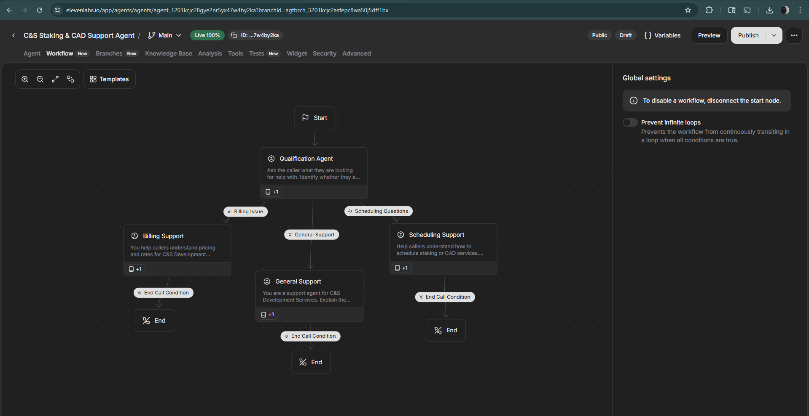

# voice-agents
Voice Agent Graded Assignment

## Agent Workflow Screenshot
The screenshot below shows the workflow for my ElevenLabs voice agent. The workflow includes a qualification agent that routes users into multiple conversation branches, including billing support, scheduling support, and general/technical support.

---

## Reflection Questions

### Branch Design Challenge
The most challenging part of designing the conversation branches was determining how to route similar user requests, such as pricing questions versus scheduling questions. Creating a qualification agent helped ensure that user intent was identified early, which made the conversation flow more organized and efficient.

### Knowledge Base Impact
The knowledge base significantly improved the accuracy and usefulness of the agent’s responses. Structured documents for pricing, scheduling, and technical support worked better than generic text because the agent could pull specific and relevant information when answering questions.

### Real-World Application
This voice agent could be used by a construction services company to handle common inquiries about services, pricing, and scheduling. It would provide 24/7 access to information while reducing the number of routine calls that require direct staff involvement.
# voice-agents
Voice Agent Graded Assignment
